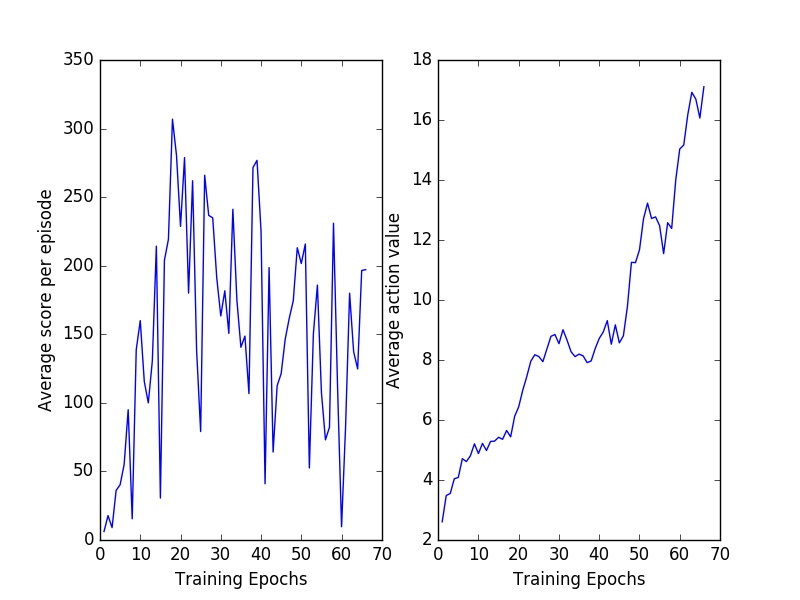
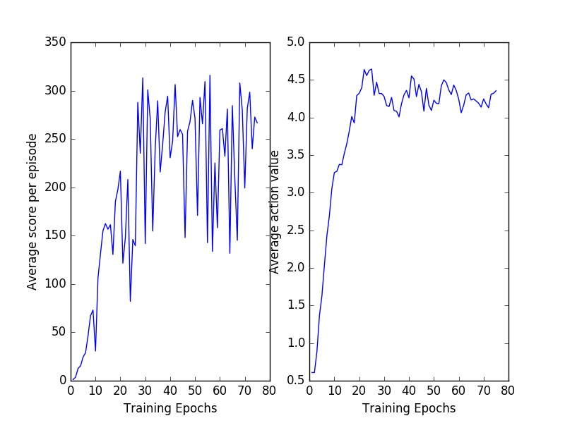

# Introduction

This package is provides a MXNet based implementation of DQN algorithm. Modified from
[Theano-based implementation of DQN](https://github.com/spragunr/deep_q_rl)

Check `q_network.py` for the detailed implementation.

# Result
It takes one night to finish 60 epoches. The training is done on GTX980 GPU.

**Our Implementation**

**Theano-based Implementation**

# Issues
* Our performance variance is too large
* Add `clip_gradient=1.0` will degrade the performance, a better value needs to be explored, currently there is no gradient clip
* Modified RMSProp optimier according to nature paper needs to be implemented, see theano based implementation in `updates.py`
* Our Q Values and Loss does not agree with theano based implementation
* Currently, `policy_executor` and `loss_executor` use different `NDArray` weights, and needs to copy weights for every batch training. Consider how to share weights with this two executors.

# Dependencies

* A reasonably modern NVIDIA GPU
* OpenCV
* [MXNet](https://github.com/dmlc/mxnet)
* [Arcade Learning Environment](http://www.arcadelearningenvironment.org/)

# Running
Use the scripts `run_nips.py` or `run_nature.py` to start all the necessary processes:

`$ ./run_nips.py --rom breakout`

`$ ./run_nature.py --rom breakout`

The `run_nips.py` script uses parameters consistent with the original
NIPS workshop paper.  This code should take 2-4 days to complete.  The
`run_nature.py` script uses parameters consistent with the Nature
paper.  The final policies should be better, but it will take 6-10
days to finish training.

Either script will store output files in a folder prefixed with the
name of the ROM.  Pickled version of the network parameters are stored
after every epoch.  The file `results.csv` will contain the testing
output.  You can plot the progress by executing `plot_results.py`:

`$ python plot_results.py breakout_05-28-17-09_0p00025_0p99/results.csv`

After training completes, you can watch the network play using the
`ale_run_watch.py` script:

`$ python ale_run_watch.py breakout_05-28-17-09_0p00025_0p99/network_file_99.pkl`

# See Also

* https://sites.google.com/a/deepmind.com/dqn

  This is the code DeepMind used for the Nature paper.  The license
  only permits the code to be used for "evaluating and reviewing" the
  claims made in the paper.

* https://github.com/muupan/dqn-in-the-caffe

  Working Caffe-based implementation.  (I haven't tried it, but there
  is a video of the agent playing Pong successfully.)

* https://github.com/kristjankorjus/Replicating-DeepMind

  Defunct?  As far as I know, this package was never fully functional.  The project is described here:
  http://robohub.org/artificial-general-intelligence-that-plays-atari-video-games-how-did-deepmind-do-it/

* https://github.com/brian473/neural_rl

  This is an almost-working implementation developed during Spring
  2014 by my student Brian Brown.  I haven't reused his code, but
  Brian and I worked together to puzzle through some of the blank
  areas of the original paper.
